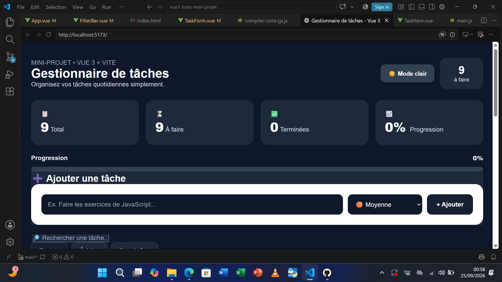
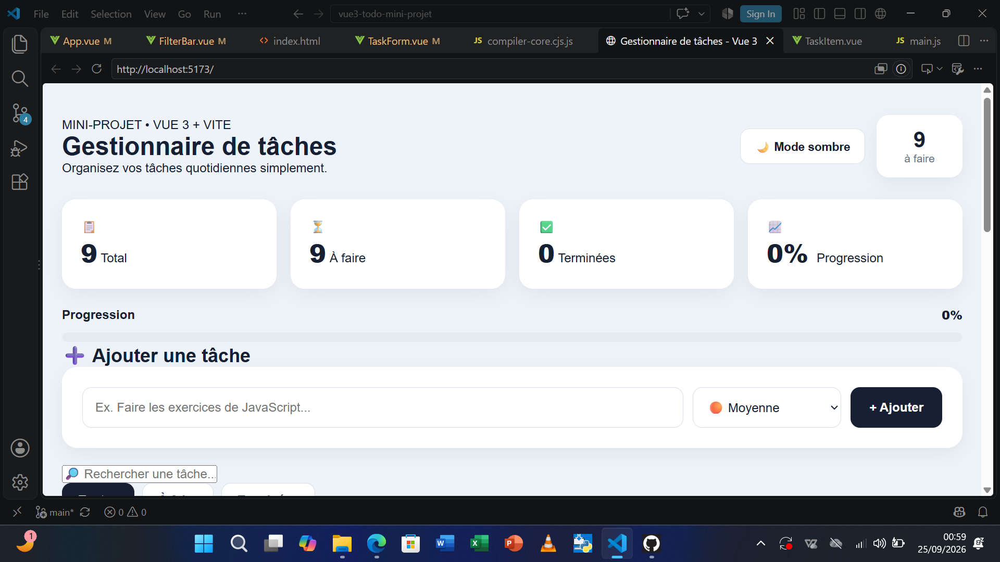
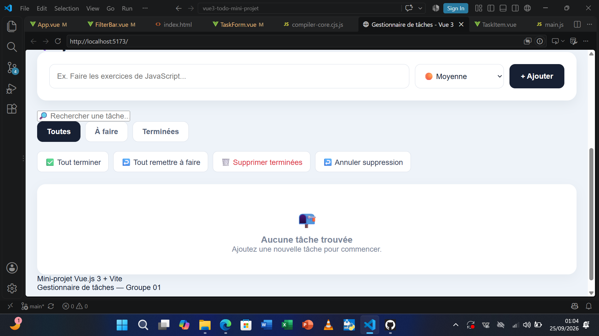
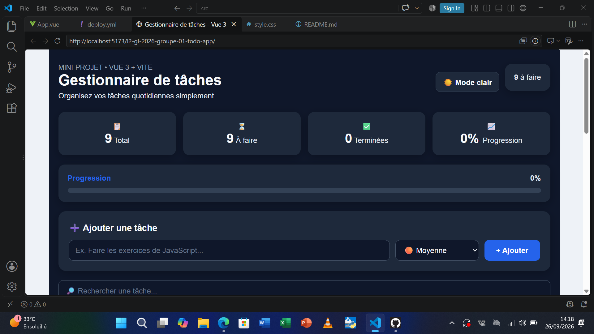
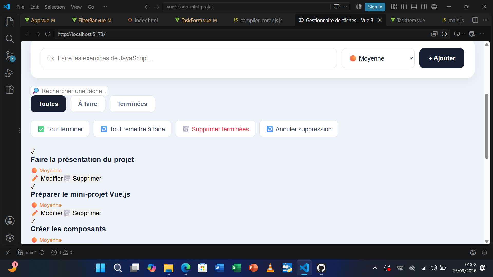
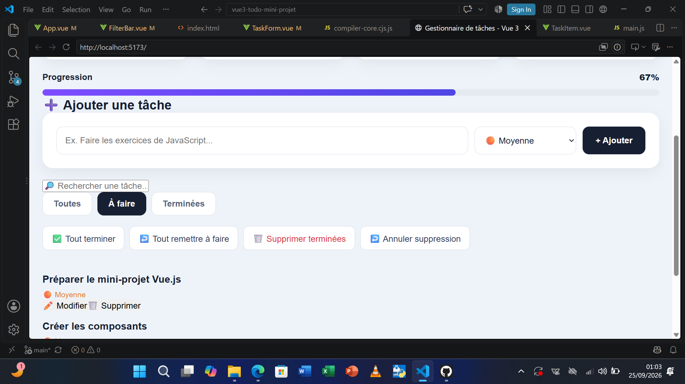
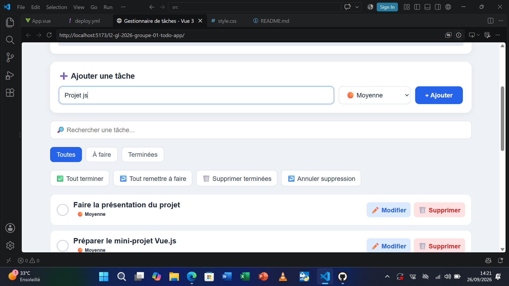
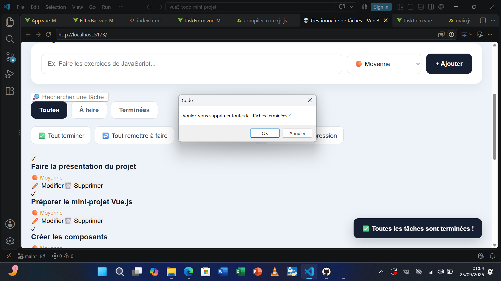

# 📝 Mini-projet Vue 3 + Vite — Gestionnaire de tâches

## 1. Présentation du projet

Application web réalisée avec **Vue.js 3** et **Vite** permettant de gérer des tâches quotidiennes.

Ce projet a été réalisé dans le cadre du mini-projet **Introduction aux Frameworks JavaScript** en Licence 2 — Génie Informatique / Génie Logiciel.

L'application permet à l'utilisateur d'ajouter, modifier, supprimer, rechercher et organiser ses tâches facilement.

---

## 2. Objectif du projet

L'objectif de ce mini-projet est de mettre en pratique les principales notions de **Vue.js 3**, notamment :

- La création de composants
- La gestion des données réactives
- Les formulaires
- Les événements
- Les `props`
- Les `emit`
- Les directives Vue.js
- `ref()`
- `computed()`
- `watch()`
- `localStorage`
- L'organisation d'un projet Vue.js
- L'utilisation de Git et GitHub

---

## 3. Membres du groupe

1. **RAJAOSOLO Manandrazana Eraelien**
2. **RASOLOFOHARIFARA Marie Rosa**

---

## 4. Technologies utilisées

- **Vue.js 3**
- **Vite**
- **JavaScript**
- **HTML5**
- **CSS3**
- **LocalStorage**
- **Git**
- **GitHub**

---

## 5. Fonctionnalités

L'application possède les fonctionnalités suivantes :

- ➕ Ajouter une tâche
- ✏️ Modifier une tâche
- 🗑️ Supprimer une tâche
- ✅ Marquer une tâche comme terminée
- 🔄 Marquer une tâche comme non terminée
- 🔎 Rechercher une tâche
- 🔽 Filtrer les tâches
- 📊 Afficher les statistiques
- 📈 Afficher le pourcentage de progression
- ⭐ Gérer les priorités
- 🌙 Mode sombre
- ☀️ Mode clair
- 💾 Sauvegarde automatique dans `localStorage`
- 🔄 Conservation des données après actualisation
- 📱 Interface adaptée à différents écrans

### Filtres disponibles

L'utilisateur peut afficher :

- Toutes les tâches
- Les tâches à faire
- Les tâches terminées

---

## 6. Notions Vue.js utilisées

### `v-model`

Utilisé pour assurer la liaison entre les champs du formulaire et les données JavaScript.

```html
<input v-model="newTask">
```

### `v-for`

Utilisé pour afficher dynamiquement la liste des tâches.

```html
<div v-for="task in tasks" :key="task.id">
  {{ task.title }}
</div>
```

### `v-if`

Utilisé pour afficher certains éléments selon une condition.

```html
<p v-if="task.completed">
  Tâche terminée
</p>
```

### Les événements

Les événements permettent de réagir aux actions de l'utilisateur.

```html
<button @click="addTask">
  Ajouter
</button>
```

### `props`

Les `props` permettent de transmettre des données d'un composant parent vers un composant enfant.

### `emit`

Les `emit` permettent à un composant enfant d'envoyer une information vers son composant parent.

### `ref()`

`ref()` est utilisé pour créer et gérer des données réactives.

```javascript
const tasks = ref([])
```

### `computed()`

`computed()` permet de créer des données calculées automatiquement.

```javascript
const completedTasks = computed(() => {
  return tasks.value.filter(task => task.completed)
})
```

### `watch()`

`watch()` permet de surveiller les changements d'une donnée.

Dans notre projet, il est notamment utilisé pour sauvegarder les tâches dans `localStorage`.

---

## 7. Organisation du projet

```text
vue3-todo-mini-project/
│
├── src/
│   ├── components/
│   │   ├── TaskForm.vue
│   │   ├── TaskList.vue
│   │   ├── TaskItem.vue
│   │   └── FilterBar.vue
│   │
│   ├── App.vue
│   └── main.js
│
├── public/
│
├── Capture1.png
├── Capture2.png
├── Capture3.png
├── Capture4.png
├── Capture5.png
├── Capture6.png
├── Capture7.png
├── Capture8.png
│
├── package.json
├── vite.config.js
└── README.md
```

---

## 8. Organisation des composants

### `App.vue`

Composant principal de l'application.

Il gère notamment :

- La liste des tâches
- L'ajout des tâches
- La modification
- La suppression
- Les filtres
- La recherche
- Les statistiques
- Le mode sombre et clair
- La sauvegarde dans `localStorage`

### `TaskForm.vue`

Permet à l'utilisateur d'ajouter une nouvelle tâche.

### `TaskList.vue`

Permet d'afficher la liste des tâches.

### `TaskItem.vue`

Représente une tâche individuelle.

Il permet notamment de :

- Modifier une tâche
- Supprimer une tâche
- Modifier son état
- Afficher sa priorité

### `FilterBar.vue`

Permet de filtrer les tâches :

- Toutes
- À faire
- Terminées

---

## 9. Installation du projet

### Prérequis

Il faut avoir installé :

- Node.js
- npm
- Git

### Installation

Cloner le projet :

```bash
git clone https://github.com/manandrazanaeraelien-dev/l2-gl-2026-groupe-01-todo-app.git
```

Entrer dans le dossier :

```bash
cd l2-gl-2026-groupe-01-todo-app
```

Installer les dépendances :

```bash
npm install
```

Lancer le serveur de développement :

```bash
npm run dev
```

Ensuite, ouvrir dans le navigateur l'adresse affichée par Vite.

---

## 10. Production

Pour générer la version de production :

```bash
npm run build
```

Pour tester la version de production :

```bash
npm run preview
```

---

## 11. Utilisation de l'application

L'utilisateur peut :

1. Ajouter une tâche.
2. Choisir sa priorité.
3. Marquer une tâche comme terminée.
4. Modifier une tâche.
5. Supprimer une tâche.
6. Rechercher une tâche.
7. Filtrer les tâches.
8. Consulter les statistiques.
9. Activer le mode sombre ou clair.

---

## 12. Sauvegarde des données

Les tâches sont sauvegardées automatiquement dans le `localStorage` du navigateur.

Cela permet de conserver les données même après une actualisation de la page.

Aucune base de données ou aucun backend n'est nécessaire pour ce projet.

---

## 13. Statistiques

L'application affiche différentes informations :

- Nombre total de tâches
- Nombre de tâches terminées
- Nombre de tâches à faire
- Pourcentage de progression

Le pourcentage de progression permet de visualiser rapidement l'avancement des tâches.

---

## 14. Contributions des membres

### RAJAOSOLO Manandrazana Eraelien

Contribution :

- Mise en place du projet Vue.js 3 + Vite
- Création de l'interface principale
- Gestion des tâches
- Ajout des fonctionnalités
- Gestion des filtres
- Gestion de la recherche
- Gestion des statistiques
- Intégration du mode sombre et clair
- Gestion de `localStorage`
- Git et GitHub
- Tests de l'application
- Préparation de la présentation

### RASOLOFOHARIFARA Marie Rosa

Contribution :

- Participation à la conception de l'interface
- Participation à la création et organisation des composants
- Participation aux tests
- Vérification des fonctionnalités
- Participation à la documentation
- Participation à la présentation du projet
- Participation à Git et GitHub

---

## 15. Git et GitHub

Le projet est versionné avec Git et hébergé sur GitHub.

Les modifications ont été enregistrées avec des messages de commit compréhensibles.

### Exemples de commits

```text
Initialisation du projet Vue 3 + Vite
Ajout de la gestion des tâches
Ajout des filtres
Ajout de la recherche
Ajout du mode sombre
Ajout des statistiques
Ajout de localStorage
Amélioration de l'interface
Ajout du README
Ajout des captures d'écran
```

---

## 16. Tests réalisés

Les fonctionnalités suivantes ont été testées :

- [x] Ajouter une tâche
- [x] Modifier une tâche
- [x] Supprimer une tâche
- [x] Marquer une tâche comme terminée
- [x] Marquer une tâche comme non terminée
- [x] Rechercher une tâche
- [x] Filtrer les tâches
- [x] Gérer les priorités
- [x] Afficher les statistiques
- [x] Afficher la progression
- [x] Mode sombre
- [x] Mode clair
- [x] Sauvegarde avec `localStorage`
- [x] Conservation des données après actualisation
- [x] Vérification de l'interface

---

# 🎤 17. Présentation orale du projet

## 👨‍💻 Présentation — RAJAOSOLO Manandrazana Eraelien

Bonjour à tous.

Nous allons vous présenter notre mini-projet réalisé avec **Vue.js 3 et Vite**.

Notre projet est un **gestionnaire de tâches**, également appelé **ToDo App**.

L'objectif est de permettre à un utilisateur de gérer facilement ses tâches quotidiennes.

Notre application permet notamment :

- d'ajouter une tâche ;
- de modifier une tâche ;
- de supprimer une tâche ;
- de marquer une tâche comme terminée ;
- de rechercher une tâche ;
- de filtrer les tâches ;
- de gérer les priorités.

Nous avons également ajouté les statistiques et le pourcentage de progression.

L'interface possède également un **mode clair et un mode sombre**.

Pour commencer, l'utilisateur peut saisir une nouvelle tâche dans le formulaire.

Après avoir ajouté une tâche, elle apparaît automatiquement dans la liste.

L'utilisateur peut ensuite la modifier ou la supprimer.

Il peut également changer l'état d'une tâche entre terminée et non terminée.

Nous avons aussi ajouté des filtres permettant d'afficher toutes les tâches, les tâches à faire ou uniquement les tâches terminées.

Enfin, les données sont sauvegardées dans le `localStorage` afin de ne pas perdre les tâches après une actualisation de la page.

Je laisse maintenant la parole à ma collègue pour expliquer la partie technique du projet.

---

## 👩‍💻 Présentation — RASOLOFOHARIFARA Marie Rosa

Merci.

Pour réaliser ce projet, nous avons utilisé principalement **Vue.js 3, Vite, JavaScript, HTML et CSS**.

Nous avons organisé l'application en plusieurs composants afin de rendre le code plus clair et plus facile à maintenir.

Les principaux composants sont :

- `App.vue`
- `TaskForm.vue`
- `TaskList.vue`
- `TaskItem.vue`
- `FilterBar.vue`

Nous avons utilisé plusieurs notions importantes de Vue.js.

Par exemple, `v-model` permet de récupérer les informations saisies dans les formulaires.

`v-for` permet d'afficher automatiquement la liste des tâches.

`v-if` permet d'afficher certains éléments selon une condition.

Nous avons également utilisé les événements comme `@click`, les `props` et les `emit` pour permettre la communication entre les composants.

Pour la gestion des données réactives, nous avons utilisé `ref()`.

Nous avons utilisé `computed()` pour calculer certaines informations comme les statistiques et la progression.

Nous avons également utilisé `watch()` pour surveiller les changements et sauvegarder les données dans `localStorage`.

Enfin, le projet a été versionné avec **Git** et hébergé sur **GitHub**.

---

## 🎯 Conclusion de la présentation

Pour conclure, ce mini-projet nous a permis de mettre en pratique les principales fonctionnalités de **Vue.js 3**.

Nous avons appris à :

- créer des composants ;
- gérer des données réactives ;
- utiliser les événements ;
- utiliser les `props` et les `emit` ;
- gérer des formulaires ;
- utiliser les directives Vue.js ;
- utiliser `localStorage` ;
- organiser un projet Vue.js ;
- utiliser Git et GitHub.

Merci pour votre attention.

---

# 🔗 18. Repository GitHub

Le code source complet du projet est disponible sur GitHub :

**Repository :**

https://github.com/manandrazanaeraelien-dev/l2-gl-2026-groupe-01-todo-app

---

# 📸 19. Captures d'écran

Les captures d'écran ci-dessous présentent les différentes fonctionnalités et interfaces de notre application.

## 🖼️ Capture 1 — Interface principale



---

## 🖼️ Capture 2 — Ajout d'une tâche



---

## 🖼️ Capture 3 — Modification d'une tâche



---

## 🖼️ Capture 4 — Tâches terminées



---

## 🖼️ Capture 5 — Filtrage des tâches



---

## 🖼️ Capture 6 — Recherche d'une tâche



---

## 🖼️ Capture 7 — Statistiques et progression



---

## 🖼️ Capture 8 — Mode sombre



---

# ✅ Conclusion

Ce mini-projet nous a permis de développer une application complète de gestion de tâches avec **Vue.js 3 et Vite**.

Il nous a également permis de pratiquer la création de composants, la réactivité, les événements, les formulaires, les filtres, le `localStorage`, ainsi que l'utilisation de **Git et GitHub**.

Le projet est fonctionnel et les principales fonctionnalités demandées ont été implémentées.

**Merci pour votre attention.**
